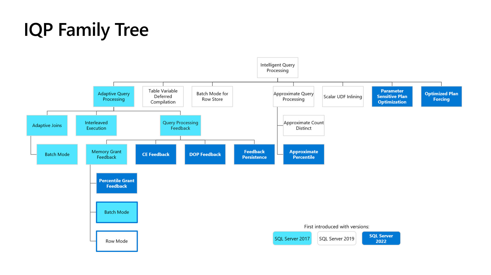
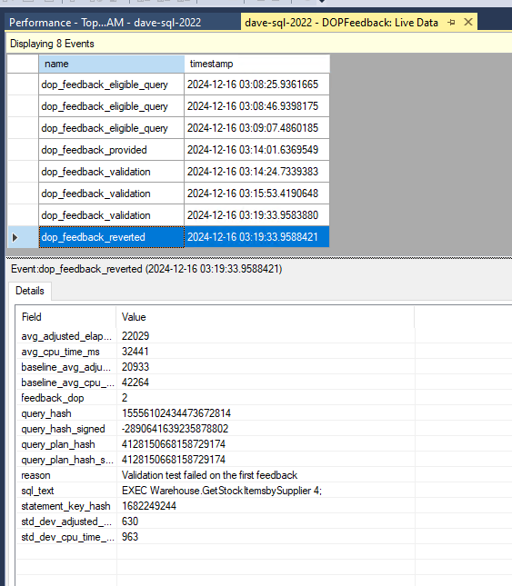

# SQL 2022 Developer Custom Class Outline

## DAY 1

### AM 

#### Introductions

* SQL 2022 Custom Class Overview
* LAB VM Tool Review
    * SSMS 20
    * SSMS 21 PREVIEW
    * AZURE DATA STUDIO
    * Visual Studio 2022 (SQL Server Data Tools)
    * GIT REPOS
        * SQL2022workshop
        * SQL2019workshop
        * SQL-SERVER-SAMPLES

#### T-SQL Enhancements

* 2022 New T-SQL Features
    * OVERVIEW - sql2022workshop\06_TSQL.md
    * General - Surface Area sql2022workshop\06_TSQL\surfacearea\readme.md
    * JSON - sql2022workshop\06_TSQL\json\readme.md
    * Time Series - sql2022workshop\06_TSQL\timeseries\readme.md
    * TempDB
        * Exercises: sql2022workshop\04_Engine\tempdb
    * Other Resources
        * https://www.mssqltips.com/sqlservertip/7265/sql-server-2022-t-sql-enhancements/

    * 2019 - Minor changes 
    * 2017
        * https://www.mssqltips.com/sqlservertip/5376/tsql-enhancements-in-sql-server-2017/              

---

### PM

#### Intelligent Query Performance (IQP)

* 2022 Slides 45-__
* 2022 Exercises - sql2022workshop/03_BuiltinQueryIntelligence
* Docs - https://learn.microsoft.com/en-us/sql/relational-databases/performance/intelligent-query-processing?view=sql-server-ver16
* Sample Demos - https://github.com/Microsoft/sql-server-samples/tree/master/samples/features/intelligent-query-processing
* [SQL Server 2022: Built-in Query Intelligence [Ep. 3] | Data Exposed](https://www.youtube.com/watch?v=Nd0mKM3O3sQ&list=PL3EZ3A8mHh0yZEkyK_Gqe3D1v3_SuP01O&index=3)
    * DOP Feedback - sql2022workshop\03_BuiltinQueryIntelligence\dopfeedback\readme.md
        * 
    * Memory Grant Feedback Persistence - sql2022workshop\03_BuiltinQueryIntelligence\persistedmgf\readme.md
    * Parameter Sensitive Plan Optimization (PSP) - sql2022workshop\03_BuiltinQueryIntelligence\pspopt\readme.md
    * TempDB Enhancements - Hands Free TempDB - sql2022workshop\04_Engine\tempdb\readme.md            
* 2019 
    * Overview: sql2019workshop\02_IntelligentPerformance.md
    * ACTIVITY: Table Variable Deferred Compilation
        * NOTEBOOK: sql2019workshop\02_IntelligentPerformance\iqp\iqp_tablevariabledeferred.ipynb
    * ACTIVITY: Using Query Store for Performance Analysis

---

## DAY 2

                

### AM
    * Review, Q & A
    * Modern Data Toolset
        * Azure Data Studio - Drilldown & Additional Features
            * Overview - https://learn.microsoft.com/en-us/azure-data-studio/?view=sql-server-ver15
            * Notebooks
                * Intro - https://learn.microsoft.com/en-us/azure-data-studio/notebooks/notebooks-sql-kernel
                * 2019 (including IQP) - https://github.com/microsoft/sql-server-samples/blob/master/samples/features/sql2019notebooks/README.md
            * Visualizations - SandDance - https://learn.microsoft.com/en-us/azure-data-studio/extensions/sanddance-extension
            * SQL Database Projects - https://learn.microsoft.com/en-us/azure-data-studio/extensions/sql-database-project-extension
            * Schema Compare - https://learn.microsoft.com/en-us/azure-data-studio/extensions/schema-compare-extension
            * SQL Server Import - https://learn.microsoft.com/en-us/azure-data-studio/extensions/sql-server-import-extension
        * SSMS 21, New Features 

---

### PM
    * [SSIS in VS 2022](https://techcommunity.microsoft.com/t5/sql-server-integration-services/bg-p/SSIS)
        * [Tutorials](https://learn.microsoft.com/en-us/sql/integration-services/integration-services-tutorials?view=sql-server-ver16)
        * [Lesson 1: Create a project and basic package with SQL Server Integration Services (SSIS)](https://learn.microsoft.com/en-us/sql/integration-services/lesson-1-create-a-project-and-basic-package-with-ssis?view=sql-server-ver16)
    * Data Virtualization
        * Polybase Overview (2019 PPT, slide 43-47)
        * Configuration: https://learn.microsoft.com/en-us/sql/relational-databases/polybase/polybase-installation?view=sql-server-ver16#use-the-installation-wizard
        * Drivers: https://www.microsoft.com/en-us/download/details.aspx?id=54920
        * Exercises: 
            * CSV - LOCAL & Network Share - See demos/Polybase CSV Demo.sql   
            * (OPTIONAL) MinIO - sql2022workshop\05_DataVirt\minio\readme.md
            * Other 2019 Exercises [https://github.com/microsoft/sqlworkshops-sql2019workshop/tree/master/sql2019workshop/08_DataVirtualization](https://github.com/microsoft/sqlworkshops-sql2019workshop/tree/master/sql2019workshop/08_DataVirtualization) 
            * Other 2022 Exercises - [https://github.com/microsoft/sqlworkshops-sql2022workshop/tree/main/sql2022workshop/05_DataVirt](https://github.com/microsoft/sqlworkshops-sql2022workshop/tree/main/sql2022workshop/05_DataVirt)

    * Q & A, Evals

---

### Other topics & Resources:

- SQL Tools Overview - https://learn.microsoft.com/en-us/sql/tools/overview-sql-tools?view=sql-server-ver16
- Data Classification
- [SQL Samples](https://learn.microsoft.com/en-us/sql/samples/sql-samples-where-are?view=sql-server-ver16#wideworldimporters-sample-database)