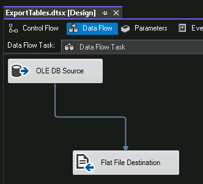

## DEMO GOAL: Step through creating SSISDB, creating a simple SSIS project and deploying to the SSISDB.

### HIGH LEVEL STEPS

#### Create SSISDB Catalog

- FROM SSMS, right click Integration Services Catalog folder and Create Catalog
-  

#### Create simple SSIS Project with Package

- Connect to SQL Server and create SSISDB
- 
- Enter strong password you can remember and click OK
- Right click SSISDB and Create Folder named *Sandbox*
- 
- Review your SSISDB
- 
- Create C:\SSISDEMO folder
- In VS 2022, Create new SSIS Project, any name, with defaults
- Rename Package.dtsx to ExportTables.dtsx
- 
- In Connection Manager, create connection to AdventureWorks2022
- 
- Add Data Flow Task
- In Data Flow Task, add OLEDB data source
- Uses dbo.DimReseller as source
- 
- In Columns, **uncheck ProductLine**
- 
- Add new Flat File Destination
    - Connect blue output line from OLE DB Source
    - Create new Flat File connection manager
        - Delimited
        - Browse to C:\SSISDEMO\, type filename DimReseller, type of CSV, click open
        - Check Columns names in first row, click OK
        - 
        - Click Mappings, OK
    - You have a basic package to export the DimReseller data to CSV
    - 
    - Debug the package and resolve any errors, verify it writes to C:\SSISDEMO
    - 
    - Delete the file (will create again)

#### Deploy Project to SSISDB

- Right Click Project and Deploy
- 
- Choose SSIS in SQL Server, next
- Enter server name localhost, and browse to /SSISDB/Sandbox/Test01, next
- 
- Click Deploy
- Locate and Execute your package
- 
- Review Overview Report
- 